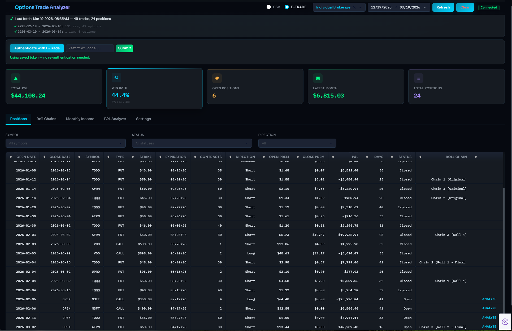
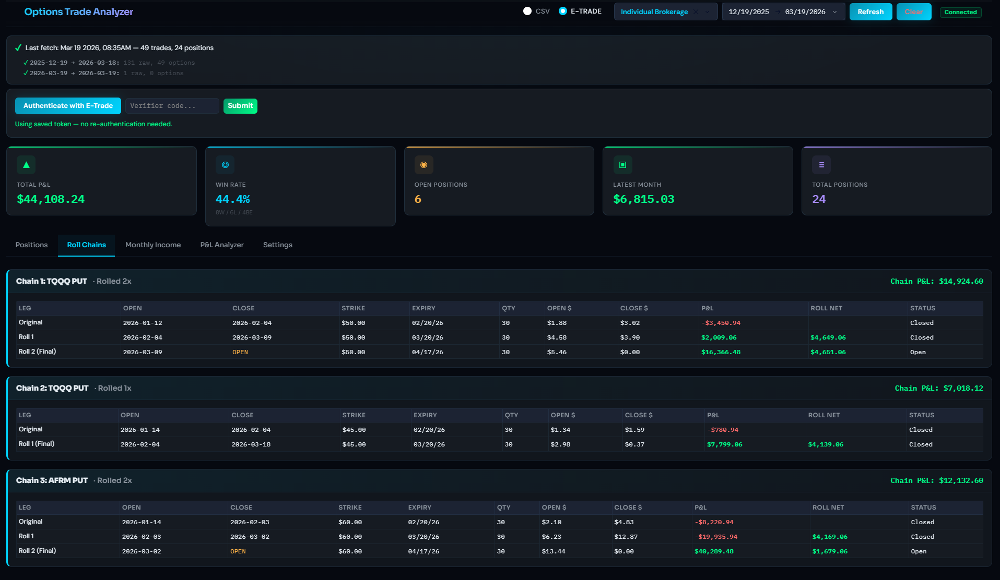
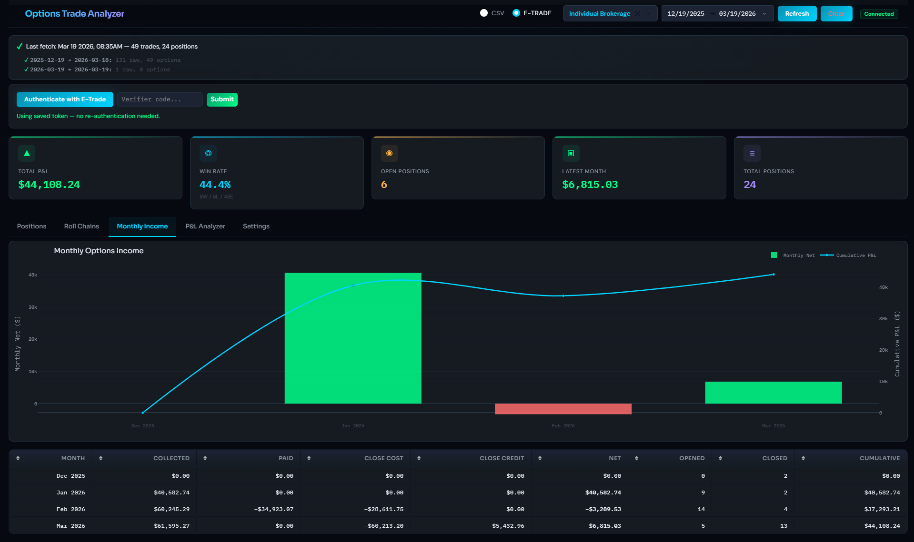
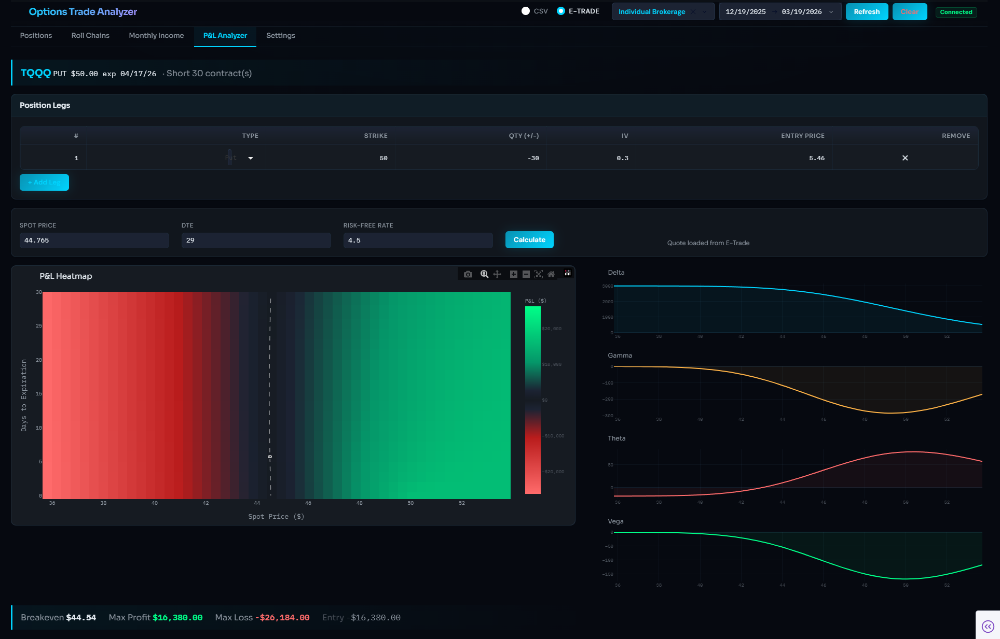

# Options Trading Dashboard

A local web dashboard and Python toolkit for analyzing options trades. Upload an E-Trade CSV or connect directly via the E-Trade API to view positions, roll chains, monthly income, and P&L analysis with interactive charts and tables.

Built with the **Obsidian Terminal** design system — a luxury dark fintech aesthetic featuring Sora + IBM Plex Mono typography, glassmorphism cards, and a cyan/mint/coral accent palette.

## Screenshots

### Positions Overview
Track all your options positions at a glance — KPI cards show total P&L, win rate, open positions, and latest month income. The sortable table highlights profits in green and losses in red, with filters for symbol, status, and direction.



### Roll Chains
Automatically detects when you rolled a position (closed and reopened on the same day) and groups them into chains. Each chain shows the full leg-by-leg history with running P&L so you can see how a position evolved over time.



### Monthly Income
Visualize your monthly cash flow with a bar chart and cumulative P&L line. The breakdown table shows premiums collected, closing costs, and net income for each month.



### P&L Analyzer — Options Heatmap
Select any open position and run a Black-Scholes analysis. The heatmap shows projected P&L across stock price and days to expiration, with Greeks (Delta, Gamma, Theta, Vega) displayed alongside.



## Quick Start

```bash
pip install -r requirements.txt
python app.py
```

Open http://localhost:8050 in your browser. Upload an E-Trade CSV to get started.

## Features

### Web Dashboard (`python app.py`)

**Tab 1 — Positions Overview**
- KPI cards: Total P&L, Win Rate, Open Positions, Latest Month Income
- Sortable/filterable positions table with conditional P&L coloring (green/red)
- Filter by symbol, status, or direction

**Tab 2 — Roll Chains**
- Automatic roll detection (same-day close + open on same symbol/type)
- Chain summary cards with leg-by-leg breakdown
- Per-chain P&L and roll count

**Tab 3 — Monthly Income**
- Bar chart of monthly net cash flow with cumulative P&L line overlay
- Detailed monthly breakdown table — see [Monthly Income Columns](#monthly-income-columns) below

**Tab 4 — Settings**
- E-Trade OAuth status and re-authentication

**Tab 5 — P&L Analyzer**
- Click "Analyze" on any open position to launch the analyzer
- Black-Scholes P&L heatmap (stock price vs DTE) with custom coral→mint colorscale
- Greeks display (Delta, Gamma, Theta, Vega) for multi-leg strategies
- Add/edit legs, adjust spot price, risk-free rate, and DTE
- Auto-fetches current spot price and IV from E-Trade when connected

**Data Sources**
- CSV upload (drag-and-drop E-Trade transaction history)
- E-Trade API (OAuth 1.0, account selector, date range picker)

### CLI Scripts

The original scripts still work standalone and now use shared `core/` modules:

- **`analyze_options.py`** — Parse CSV, build positions, output P&L summary to CSV
- **`analyze_rolls.py`** — Same as above plus roll chain detection and monthly income
- **`options_pl_tracker.py`** — Black-Scholes P&L heatmaps, Greeks, theta decay visualization

## Project Structure

```
app.py                  # Dash app entry point
config.py               # Server and API settings

core/                   # Shared analysis logic
    parser.py           # CSV parsing + trade normalization
    positions.py        # Position building, P&L calculation
    rolls.py            # Roll detection, chain building
    monthly.py          # Monthly income aggregation
    pricing.py          # Black-Scholes, Greeks (used by options_pl_tracker)

etrade/                 # E-Trade API integration
    auth.py             # OAuth 1.0 three-legged flow (tokens via keyring)
    client.py           # Accounts + paginated transaction fetching
    models.py           # API JSON -> normalized trade dicts

dashboard/              # Dash UI layer
    layout.py           # Tab layout, navigation, data stores
    callbacks.py        # All Dash callbacks
    components.py       # KPI cards, formatting helpers
    charts.py           # Plotly figure builders

analyze_options.py      # CLI: basic position analysis
analyze_rolls.py        # CLI: roll detection + monthly income
options_pl_tracker.py   # CLI: Black-Scholes P&L visualization
```

## E-Trade API Setup

1. Create a `.env` file in the project root:

```
ETRADE_CONSUMER_KEY=your_consumer_key
ETRADE_CONSUMER_SECRET=your_consumer_secret
```

2. In the dashboard, switch to "E-Trade API" mode and click "Authenticate with E-Trade"
3. A browser window opens — authorize the app in E-Trade
4. Paste the verifier code back into the dashboard and click "Submit Code"
5. Select an account from the dropdown, set a date range, then click "Refresh"

**Token persistence:** Tokens are stored in Windows Credential Manager via `keyring`. On restart, the dashboard automatically checks for a saved token and reconnects without re-authentication. You only need to re-authenticate if the token has expired (tokens expire at midnight ET daily).

## CSV Input Format

The scripts expect an E-Trade transaction history CSV with these columns:

| Column | Field |
|--------|-------|
| 0 | Activity/Trade Date (MM/DD/YYYY) |
| 3 | Activity Type |
| 4 | Description (`CALL/PUT SYMBOL MM/DD/YY STRIKE`) |
| 7 | Quantity |
| 8 | Price (per share) |
| 9 | Amount (total) |
| 10 | Commission |

**Supported activity types:** `Sold Short`, `Bought To Open`, `Bought To Cover`, `Sold To Close`, `Option Expired`, `Option Assigned`, `MISC` (stock split detection)

## Monthly Income Columns

The Monthly Income tab table breaks down cash flow by month across these columns:

| Column | Description |
|--------|-------------|
| **Month** | Calendar month of the activity |
| **Premiums Collected** | Cash received from selling options to open (`Sold Short`). Always positive — this is your income. |
| **Premiums Paid** | Cash spent buying options to open long positions (`Bought To Open`). Negative = you paid. |
| **Close Cost (BTC)** | Cash spent to Buy To Close — buying back options you previously sold short. Negative = you paid to exit. |
| **Close Credit (STC)** | Cash received from Sell To Close — selling long options you previously bought. Positive = you received. |
| **Net Cash Flow** | Sum of all four above. Your actual cash in/out for the month. This is the green bar in the chart. |
| **# Opened** | Number of individual option trades opened that month |
| **# Closed** | Number of individual option trades closed, expired, or assigned that month |
| **Cumulative P&L** | Running total of Net Cash Flow across all months — the yellow line in the chart |

**Example:** A month where you collected $65k in premiums but paid $34k to buy back positions and $28k to close others would show a Net Cash Flow of only ~$3k — most income was offset by closing costs.

## P&L Tracker Usage

Configure your trade directly in `options_pl_tracker.py`:

```python
legs = [
    {'type': 'call', 'strike': 350, 'qty': 4, 'entry_price': 64.47, 'iv': 0.16},
    {'type': 'call', 'strike': 400, 'qty': -2, 'entry_price': 32.49, 'iv': 0.15},
]
entry_date  = datetime(2026, 2, 6)
expiry_date = datetime(2026, 7, 17)
current_price = 401.32
```

```bash
python options_pl_tracker.py
```

Outputs `options_pl_analysis.png` with P&L heatmap, DTE curves, theta decay, P&L table, and Greeks summary.

## Dependencies

```
dash, dash-bootstrap-components, plotly    # Dashboard
numpy, scipy, matplotlib                   # Analysis + visualization
requests-oauthlib, python-dotenv, keyring  # E-Trade API auth
```

## Roadmap

- [x] Core module extraction from flat scripts
- [x] Interactive web dashboard with CSV upload
- [x] Roll chain visualization
- [x] Monthly income charts
- [x] E-Trade API integration
- [x] P&L Analyzer tab (Black-Scholes heatmaps + Greeks in browser via Plotly)
- [x] Obsidian Terminal design system (glassmorphism, custom typography, refined dark theme)
- [ ] Local caching of fetched transactions
- [ ] Portfolio-level analysis across multiple accounts

## Author

Sachin Saner

---

*This tool is for analysis purposes only. Always verify calculations independently. Past performance does not guarantee future results.*
